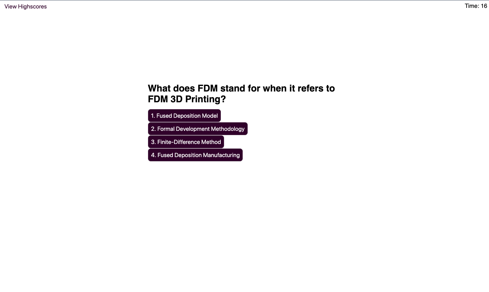

# 3D Printing Quiz

Preview Site
https://livingkurt.github.io/3D-Printing-Quiz/

## Description

For all of those who wish to test there 3D printing terminology. I have a special quiz just for you.

This quiz will be 

* 5 questions long
* Multiple Choice
* And to Be completed within the designated time limit
* You will also be able to save your highscores with your initials by it.

Good Luck!

## Game Play

I created a sleak responsive UI that you should not have to wonder what or where to click next

I first created all of my html with very basic information

Made some default css that has room to change

Then using javascript I brought the quiz to life 

So you'll never need to load a new page

The quiz begins with the 

* Title
* Description of the rules
* Start Quiz Button

You will now be shown a question with 4 choices for the answer

Simultaniously there will be a timer that will count down in the upper right corner

If the timer runs out before you are done, you must start over and will lose your work.

You will also be docked 5 seconds for every answer get wrong.

Its a dog eat dog world in the 3D printing world.

You'll understand soon enough.

Anyways, After you answer 5 question within the time alotted.

You will be promted with a new set of elements to save your initials and score that you recieved.

After you press submit, it will show previous scores on a chart, where they will be saved unless you click the "Clear Highscores" button

Then they will be gone forever!

### Try your best to stay alive!

