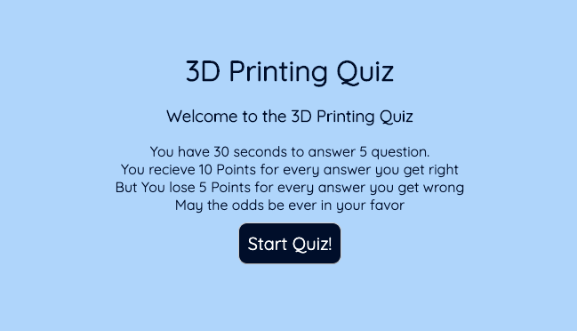

# 3D Printing Quiz

Preview Site
https://livingkurt.github.io/3D-Printing-Quiz/

## Description

For all of those who wish to test there 3D printing terminology. I have a special quiz just for you.

This quiz will be 

* 5 questions long
* Multiple Choice
* And to Be completed within the designated time limit
* You will also be able to save your highscores with your initials by it.

Good Luck!

## Opening for the First Time:

The main container contains a 

* Title
* Description of the rules
* Start Quiz Button

In the top left and right corners there is a button and a label

* View Highscores
* Time: 30

Simple enough interface, if you would like to play
Click Start Quiz

If you would like to view previous highscores that you have made
You click View Highscores

## When the user clicks "Start Quiz":

You will now be shown a question with 4 choices possible answers

Simultaniously there will be a timer that will count down in the upper right corner

If the timer runs out before you are done, the "You Lose" page will appear, then you must start over.

## How the Score is tallied:

For every question answered correctly the user recieves 10 Points!
And how many seconds left on the timer when you finished.

So if you got 3 question right.
And had 8 seconds left on the timer

Your score would be 38 points!

For every question answered incorrectly the timer is deducted by 5 seconds.
So you better hurry
But dont be sloppy

## After You Complete the Quiz:

After you answer 5 question within the time alotted.

You will be promted with a new set of elements to save your initials and score that you recieved.

After you press submit, it will show previous scores on a chart, where they will be saved unless you click the "Clear Highscores" button

Then they will be gone forever!

